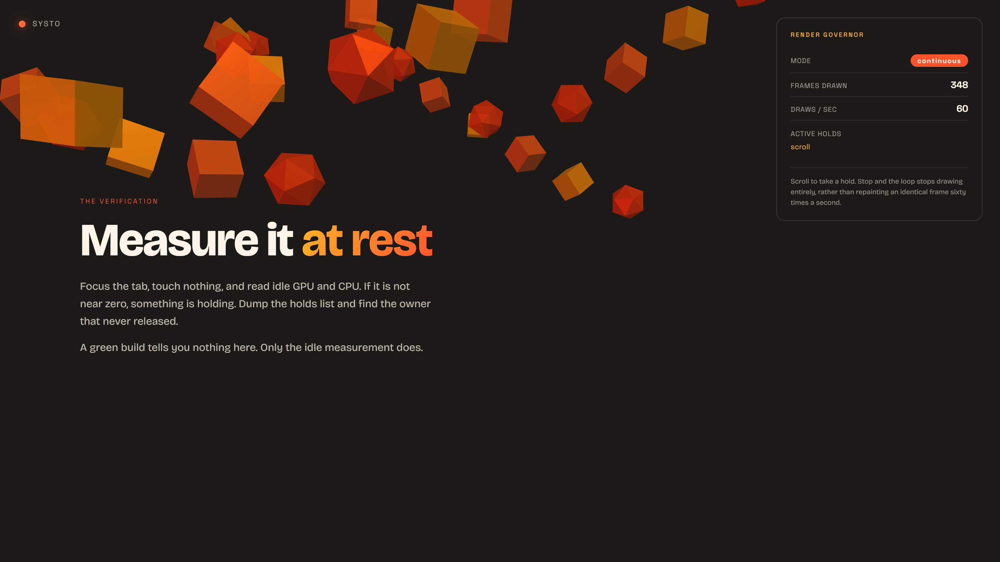
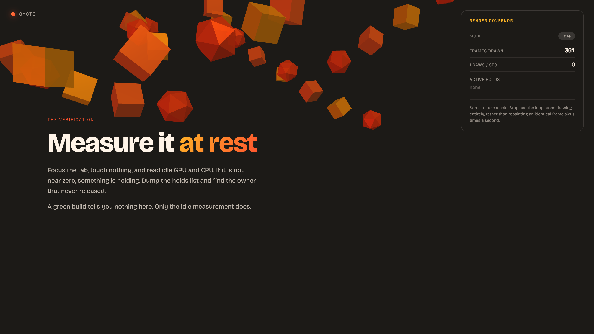

# threejs-scroll-sites

**A Systo skill.** Build scroll-driven Three.js websites that stay smooth, and stop
burning a phone battery when nobody is touching them.

Scroll sites are not games. A game runs a simulation and renders it. A scroll site maps
a single scalar, scroll progress, onto scene state, deterministically. Get that mapping
right and everything else follows. This skill is the accumulated set of rules that make
that true in practice, each one attached to a bug that actually happened.

---

## The idle render governor

The headline technique, and the reason this repo has screenshots.

One ticker fixes phase drift between Lenis, GSAP and the renderer. It does not stop you
drawing sixty identical frames a second at a dead stop. Measured from two directions:

| Case | Idle cost with no input |
|---|---|
| A Cesium globe, zero data layers, parked camera | ~60% GPU, ~54% of a core |
| A production marketing site, ~31 infinite CSS animations | 43 to 74% CPU |

Idle cost is the default unless you design it away. The fix is a binary mode driven by
ref-counted holds: any per-frame animator holds for exactly the lifetime of its
animation, and with zero holds you skip the draw entirely.

### Scrolling: the loop is held open



`MODE continuous`, `DRAWS / SEC 60`, `ACTIVE HOLDS scroll`. Something is genuinely
animating, so the loop runs.

### At rest: the loop stops entirely



`MODE idle`, `DRAWS / SEC 0`, `ACTIVE HOLDS none`. The frame counter is frozen. Not
throttled, not reduced. Stopped.

Both screenshots come from `demo/index.html` in this repo, captured through a real GPU
path. The instrumented numbers behind them:

```
A continuous: {'mode': 'continuous', 'holds': ['scroll'], 'frames': 348}
B idle:       {'mode': 'idle', 'holds': []}
frames while idle: 361 -> 361 (delta 0 over ~1.6s)
```

### Run the demo

```bash
python -m http.server 8810 --directory demo
```

Open `http://localhost:8810`, scroll, then stop and watch the panel. `window.__governor`
is exposed so you can drive it from the console:

```js
__governor.diagnostics()   // { mode: 'idle', holds: [] }
__governor.hold('manual')  // flips to continuous
__governor.release('manual')
```

---

## What else is in the skill

`SKILL.md` is the whole thing. The sections that carry the most weight:

| Section | What it prevents |
|---|---|
| **The one rule** | Never mutate Three.js state inside a scroll handler. Scroll events outpace frames, and reading layout inside one forces reflow. Scroll writes to a plain object; the render loop reads it. |
| **Stack, verified** | Pinned versions that actually work together, including the fact that `three` ships no types and that every GSAP plugin has been free since April 2025. |
| **Single-ticker architecture** | Three separate rAF loops drifting out of phase, which people misdiagnose as "the model is too heavy". |
| **Idle render governor** | The battery cost above. |
| **Renderer baseline** | Uncapped `devicePixelRatio` on a 3x phone renders nine times the pixels. The single most common cause of "smooth on desktop, unusable on mobile". |
| **Gotchas** | The failures that cost real debugging time, including the `uniformsUtils.merge()` clone that silently breaks per-frame uniform writes. |

Three reference files load on demand rather than up front: `scroll-patterns.md`,
`lenis-gsap-integration.md`, and `performance-and-a11y.md`.

---

## Install

```bash
git clone https://github.com/systoai-design/threejs-scroll-sites.git ~/.claude/skills/threejs-scroll-sites
```

On Windows, clone to a data drive and expose it with a junction rather than putting the
repo on `C:`:

```powershell
git clone https://github.com/systoai-design/threejs-scroll-sites.git "E:\New Claude\skills\threejs-scroll-sites"
New-Item -ItemType Junction -Path "$env:USERPROFILE\.claude\skills\threejs-scroll-sites" -Target "E:\New Claude\skills\threejs-scroll-sites"
```

## Layout

```
SKILL.md      the skill itself
references/   loaded on demand, not up front
demo/         runnable render-governor demo, three.js vendored
docs/         the screenshots above
```

## Related Systo skills

- [**hyperframes-render-discipline**](https://github.com/systoai-design/hyperframes-render-discipline) for capturing frames off a governed loop. A governed
  page is not drawing while you sit there, so a naive screenshot returns a cleared buffer.
- [**swipefile**](https://github.com/systoai-design/swipefile) for capturing a reference site's design system before you build against it.
- [**motion-graphics-director**](https://github.com/systoai-design/motion-graphics-director) for linear video work rather than scroll-driven 3D.

## House style

Plain English, confident, warm. No em dashes.

Verified on Windows 11, three 0.185, Python 3.12, Playwright.
